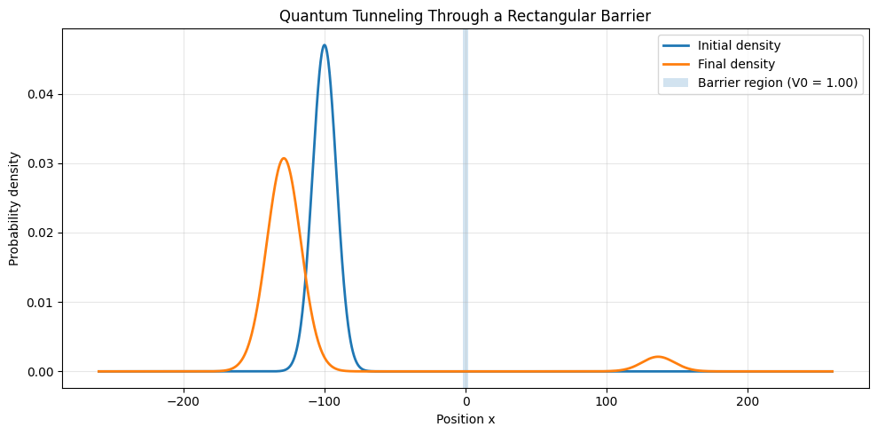
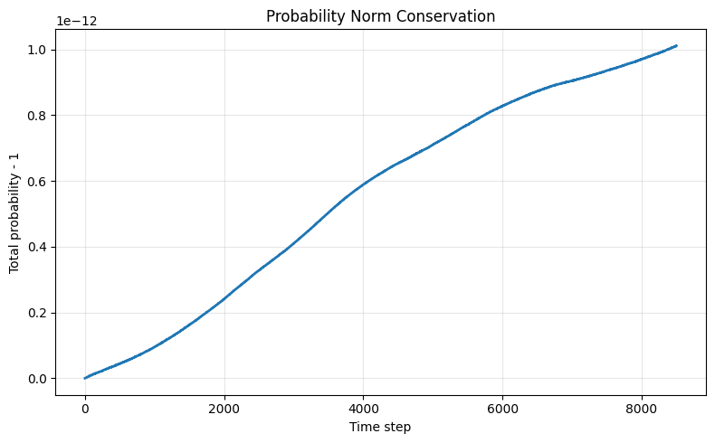
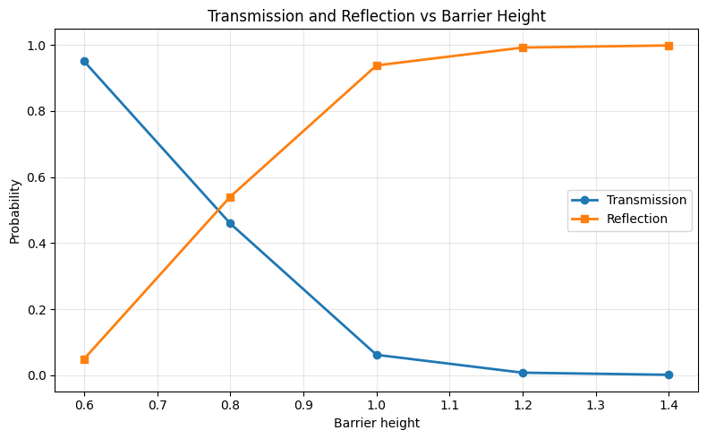
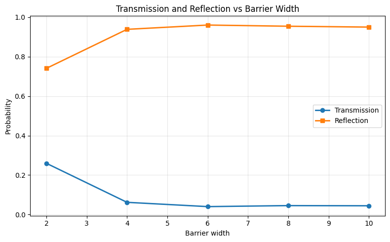
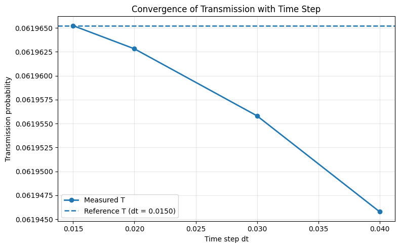

# Quantum Tunneling Wave Packet Simulation

This project presents a numerical simulation of **quantum tunneling** using the **time-dependent Schrödinger equation**.

The simulation models the propagation of a **Gaussian wave packet** traveling toward a **rectangular potential barrier**. When the wave packet reaches the barrier, part of the probability density reflects while another portion penetrates and emerges on the other side.

This behavior demonstrates the fundamental quantum mechanical phenomenon known as **quantum tunneling**, where particles can pass through energy barriers even when their energy is lower than the barrier height.

The Schrödinger equation is solved numerically using the **Split-Step Fourier Method**, a spectral technique widely used in computational quantum mechanics. The method alternates between position space and momentum space using the **Fast Fourier Transform (FFT)** to efficiently compute the wavefunction evolution.

Through this simulation we can visualize several important physical effects:

- propagation of a localized quantum wave packet  
- interaction of the wave packet with a potential barrier  
- partial reflection and transmission of probability density  
- conservation of total probability  
- dependence of tunneling probability on barrier height and width  

The project also performs **parameter sweeps** to analyze how tunneling probability changes when the barrier properties are varied.

---

# Physics Model

The system is governed by the **time-dependent Schrödinger equation**

```math
i\hbar \frac{\partial \psi(x,t)}{\partial t}
=
-\frac{\hbar^2}{2m}\frac{\partial^2 \psi(x,t)}{\partial x^2}
+
V(x)\psi(x,t)
```

where

- \( \psi(x,t) \) is the wavefunction  
- \( V(x) \) is the potential energy  
- \( m \) is the particle mass  
- \( \hbar \) is the reduced Planck constant  

---

# Initial Wave Packet

The particle is initialized as a **Gaussian wave packet**

```math
\psi(x,0) =
\exp\left(-\frac{(x-x_0)^2}{2\sigma^2}\right)e^{ik_0 x}
```

where

- \(x_0\) = initial position  
- \(\sigma\) = packet width  
- \(k_0\) = central momentum  

The approximate kinetic energy of the packet is

```math
E = \frac{k_0^2}{2}
```

---

# Potential Barrier

The simulation uses a **rectangular potential barrier**

```math
V(x)=
\begin{cases}
V_0 & |x| \le \frac{a}{2} \\
0 & |x| > \frac{a}{2}
\end{cases}
```

where

- \(V_0\) = barrier height  
- \(a\) = barrier width  

If the particle energy satisfies

```math
E < V_0
```

classically the particle would be completely reflected.  
Quantum mechanics allows a finite **transmission probability**, producing tunneling.

---

# Numerical Method

The wavefunction is evolved in time using the **Split-Step Fourier Method**.

The time evolution operator is approximated as

```math
e^{-iH\Delta t/\hbar}
\approx
e^{-iV\Delta t/2\hbar}
e^{-iT\Delta t/\hbar}
e^{-iV\Delta t/2\hbar}
```

where

- \(T\) is the kinetic operator  
- \(V\) is the potential operator  

The kinetic step is computed in **momentum space** using the **Fast Fourier Transform (FFT)**.

This approach provides an efficient and stable numerical method for simulating quantum wave packet dynamics.

---

# Simulation Results

## Wave Packet Scattering

The Gaussian wave packet approaches the barrier. Part of the packet reflects while another portion tunnels through the barrier.



---

## Probability Conservation

The simulation preserves total probability with extremely small numerical error.



---

## Transmission vs Barrier Height

Increasing the barrier height decreases the tunneling probability.



---

## Transmission vs Barrier Width

Increasing the barrier width also reduces tunneling probability.



---

## Time-Step Convergence

This plot verifies numerical stability by showing convergence as the time step is reduced.



---

# Running the Simulation

Clone the repository

```bash
git clone https://github.com/Umayrutmaan/quantum-tunneling-wavepacket-simulation.git
cd quantum-tunneling-wavepacket-simulation
```

Install dependencies

```bash
pip install -r requirements.txt
```

Run the simulation

```bash
python src/tunneling_simulation.py
```

The generated plots will be saved inside the **results** folder.

---

# Project Structure

```
quantum-tunneling-wavepacket-simulation
│
├── src
│   └── tunneling_simulation.py
│
├── results
│   ├── wavepacket_density.png
│   ├── norm_conservation_error.png
│   ├── transmission_vs_height.png
│   ├── transmission_vs_width.png
│   └── convergence_dt.png
│
├── requirements.txt
├── README.md
└── LICENSE
```

---

# Technologies Used

- Python  
- NumPy  
- Matplotlib  
- Fast Fourier Transform (FFT)

---

# Purpose of the Project

This project demonstrates how **computational methods can be used to study quantum mechanical systems**. It combines physics concepts with numerical algorithms and visualization to explore wave-packet propagation, scattering, and quantum tunneling.

The work serves as a small **computational physics study of quantum dynamics and numerical simulation**.

---

# Author

**Umayr Utmaan**

Physics student interested in **quantum mechanics, computational physics, and numerical simulation**.
